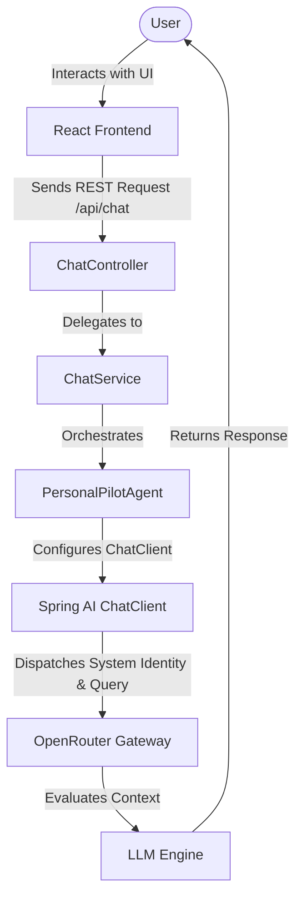

# PersonalPilot

### Your private, evolving personal AI agent built with Spring Boot and React.

---

## Project Overview

**PersonalPilot** is an evolving personal AI agent being built to understand a user's goals, reason through complex tasks, leverage targeted tools, and securely execute approved actions on the user's behalf. 

Rather than acting as a generic, reactive chatbot, PersonalPilot is engineered from the ground up as a proactive agentic framework. It combines the rigorous backend orchestration capabilities of Java and Spring Boot with a responsive React frontend to lay down a reliable engineering foundation for autonomous task resolution.

---

## Why PersonalPilot?

* **Privacy-First Architecture:** Designed to keep personal data, system prompts, and tool contextual boundaries under the user's ultimate control.
* **Agentic Foundation:** Built intentionally as the foundation for the future agentic architecture, preparing the system for multi-step reasoning rather than just static question-and-answer exchanges.
* **Robust Enterprise Stack:** Avoids brittle scripting workarounds by leveraging Spring AI for native LLM lifecycle management and structured data processing.

---

## Core Idea

The ultimate objective of PersonalPilot is to serve as an intelligent intermediary layer between the user and their digital ecosystem. It establishes a robust, extensible pipeline where an AI agent can ingest user queries, reason out execution plans, invoke external utilities, and coordinate real-world tasks safely without exposing credentials or executing unvetted actions.

---

## Live Demo

You can view the user interface mockup here:  
👉 **https://mohammed-hamza-dev.github.io/PersonalPilot/**

> ⚠️ **Note:** The static frontend demo hosted on GitHub Pages requires a locally running backend server to process live requests. It does not connect to a publicly hosted AI backend at this stage.

---

## Architecture

PersonalPilot utilizes a direct synchronous execution loop to pass user messages securely from the interface down to the decoupled backend agent service.

### Technical Data Flow

### Visual Execution Architecture


---

## Current Implementation

The initial developmental milestone focuses entirely on end-to-end integration connectivity and core API structural grounding. The current codebase implements:

* **React + Vite Interface:** A clean, responsive, and functional conversational window optimized for chat interactions.
* **Spring Boot REST Backend:** Provides a structured, dedicated `/api/chat` endpoint designed to handle incoming data objects safely.
* **Bi-Directional Communication:** Full integration hook allowing the React frontend to pass user requests and parse backend responses seamlessly.
* **Spring AI Integration:** Leverages the native Spring ecosystem for direct configuration of chat properties, models, and execution instances.
* **OpenRouter Gateway:** Clean cloud communication handling out-of-the-box routing to diverse foundation LLM provider targets.
* **Identity Configuration:** Hardened system identity definitions that establish the initial PersonalPilot persona framework.
* **Environment Configuration:** Secure handling of third-party API properties using local runtime shell parameters.

---

## Planned Agentic Capabilities

The foundational integration layer is designed to evolve into a workflow engine capable of progressively supporting agentic task execution. Upcoming architectural milestones include:

* **Tool Registry & Calling:** A declarative framework allowing the LLM engine to dynamically select and invoke specialized system functions.
* **Web & Search Utilities:** Real-time web retrieval tools to inject current contextual information into agent prompts.
* **Utility Engines:** Math calculators and formatting layers for highly deterministic background data processing.
* **Contextual Productivity Tools:** Integrated engines for checking local restaurant indices, setting system reminders, and managing calendar scheduling.
* **Personal Long-Term Memory:** Vector storage layers designed to securely capture user preferences and context history over time.
* **Human-in-the-Loop Gateway:** Intercept mechanisms designed to request explicit user approval before triggering any sensitive or external write actions.

---

## Tech Stack

* **Frontend:** React, Vite, JavaScript, HTML5, CSS3
* **Backend Framework:** Java, Spring Boot
* **AI Framework:** Spring AI
* **LLM Gateway Provider:** OpenRouter
* **Communication Layer:** REST API
* **Version Control:** Git + GitHub

---

## Project Structure

The project maintains a lean package hierarchy separating frontend assets from the unified backend source tree.

```text
PersonalPilot/
├── backend/
│   ├── mvnw                               # Maven Wrapper Script (Linux/macOS)
│   ├── mvnw.cmd                           # Maven Wrapper Script (Windows)
│   ├── .mvn/                              # Maven Wrapper configuration files
│   ├── pom.xml                            # Project dependency configuration
│   └── src/
│       └── main/
│           └── java/
│               └── com/
│                   └── personalpilot/
│                       └── backend/
│                           ├── BackendApplication.java     # Application Bootstrapper
│                           ├── ChatController.java         # REST Controller (/api/chat)
│                           ├── ChatRequest.java            # Inbound Request DTO
│                           ├── ChatResponse.java           # Outbound Response DTO
│                           ├── ChatService.java            # Business logic layer
│                           └── PersonalPilotAgent.java     # Agent implementation
└── frontend/
    ├── package.json
    ├── src/
    └── vite.config.js
```

---

## Getting Started

### Prerequisites
* **Java JDK 21+**
* **Node.js** (v18+ recommended)

---

## Environment Variable Security

PersonalPilot communicates with OpenRouter using a dedicated API key asset. To protect your cloud services, follow these fundamental safety protocols:

* 🚨 **Never** check your API key directly into your repository or commit it to GitHub.
* 🚨 **Never** place active production API credentials inside your static `application.properties` configuration file.
* 🚨 **Never** pass or expose the API token to the client-side React frontend application.

### Local Development Configuration
For local development, pass the credential securely via your active system shell environment:

```bash
# macOS / Linux
export OPENROUTER_API_KEY="your_actual_api_key_here"

# Windows (Command Prompt)
set OPENROUTER_API_KEY=your_actual_api_key_here

# Windows (PowerShell)
$env:OPENROUTER_API_KEY="your_actual_api_key_here"
```

For cloud deployments, pass this variable strictly using your specific hosting provider's native encrypted secret management toolset.

---

## Running the Project

### 1. Launch the Backend Server
The backend repository contains an included Maven Wrapper (`mvnw`). You do **not** need to install Maven separately just to run the project.

```bash
cd backend
./mvnw spring-boot:run
```

The Spring Boot backend will bootstrap locally, reading the API token directly from your terminal session's environment space.

### 2. Launch the Frontend Interface
Open a second terminal window to start the Vite local development pipeline:

```bash
cd frontend
npm install
npm run dev
```

Open the local network address displayed in your shell logs to interact with the system interface.

---

## Security

Security is treated as a foundational element of the PersonalPilot architecture. Because the application handles conversational context and is slated to interface with outer APIs, the structural design isolates the LLM interface entirely inside the protected Java backend environment. 

Advanced authentication checkpoints, token validation mechanisms, and explicit **Human-in-the-Loop approval workflows** are explicitly slated as part of the core agentic roadmap before any external tool-calling capabilities are deployed.

---

## Development Roadmap

### Phase 1 — Foundation ── *[CURRENT STAGE]*
- [x] React chat interface layout
- [x] Spring Boot REST backend pipeline
- [x] React ↔ Spring Boot endpoint communication
- [x] Spring AI framework integration
- [x] OpenRouter connection testing
- [x] PersonalPilot agent system identity setup

### Phase 2 — Agentic Core
- [ ] Declarative tool-calling capabilities
- [ ] Dynamic tool registry service
- [ ] Agent multi-step reasoning orchestration
- [ ] Tool execution error and result parsing handlers

### Phase 3 — Personal Intelligence
- [ ] Short-term conversation history persistence
- [ ] Dynamic user preference interceptors
- [ ] Long-term semantic memory storage

### Phase 4 — Real-World Tools
- [ ] Active web search tools
- [ ] Restaurant and local geographic search integration
- [ ] Contextual reminder engines
- [ ] Calendar schedule hooks
- [ ] Secure outer third-party service connection integrations

### Phase 5 — Security & Deployment
- [ ] User authentication layer
- [ ] Explicit user approval intercept workflows
- [ ] System API rate limiting
- [ ] Secure cloud environment deployment configurations

---

## Future Vision

PersonalPilot aims to evolve into a private personal AI agent that can cleanly understand high-level user goals, reason about complex multi-step tasks, execute specialized digital tools, remember critical context, and automate administrative routines while maintaining high operational transparency and keeping the user firmly in control.

---

## Author

**Mohammed Hamza A E**  
* GitHub: https://github.com/mohammed-hamza-dev

---

## License

License information will be added as the project develops.
